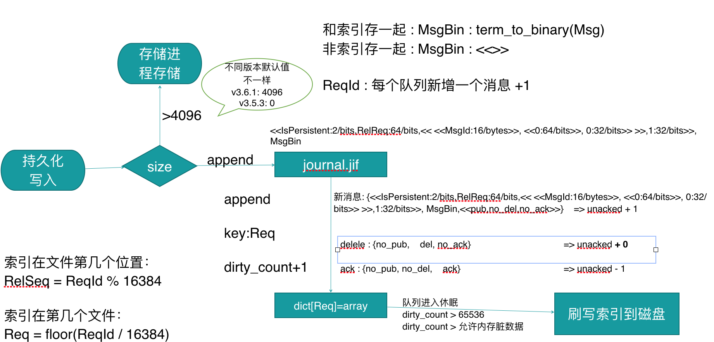

# 写入过程-索引持久化

每个索引文件限定了**==每个索引最大存储 16384 条消息的索引==**.这个不能修改.

而数据存储则是多个队列公用的 并且==每个数据存储文件和索引文件不一样,并不是按最大存储多少条消息有关,则是每个存储文件是16M(这个大小可以个性,rabbitmq.config配置文件中的msg_store_file_size_limit)==。

如果在存储的时候发送存储文件大于16M后则再创建一个文件.

如果发现数据文件相继续消费者都 提交了ack操作后,则会进行一定程度的数据合并. 释放磁盘空间

---


### 写入过程



#### 1. 每个队列都有一个变量ReqId,是自增的,每提交进来一消息进行+1. 


这里把它命名为ReqId

因为每个索引文件最多保存16384个消息的索引,所以==可以通过ReqId算出当前消息应该保存在哪一个索引文件中及当前消息在索引文件中第几个位置==

> 消息保存在第几个索引文件中
> ==Req = floor(ReqId / 16384)==
 
> 索引在索引文件中第几个位置
> ==RelSeq = ReqId % 16384==


#### 2. 将数据写入到队列对应文件夹下面的journal.jif 日志文件中


这个操作是==append追加操作==,并且这个操作并没有调用内核层的fsync操作。

==只是写到内核层.属于内存操作,是否刷盘由内核自行决定==.(这些可以去参考文件系统相应知识点)

数据格式为


```
<<IsPersistent/2/bits,ReqId:64/bits,<< <<MsgId:16/bytes>>, <<Expiry:64/bits>>, msgSize:32/bits>> >>,size(MsgBin):32/bit, MsgBin>>
```


语法解释：

**<<>>** , 这个是Erlang里的位操作二进制格式数据.

由于Erlang对位操作非常方便,RabbitMQ在存储数据的时候,在1个字节中用不同位存了不同的数据. 这和我们用其他语言编译存储数据的大多数情况下不同.

其他语言我们可能经常只细化到用了几个字节.在未知长度的情况下,可能喜欢在前面4个字节存的是接下来的长度是多少,然后接下来存未知的数据. 

有些就会说RabbitMQ这样存储,他读取文件是怎么读取的 ?

这里正则不是这样设计的,==RabbitMQ 读取文件一次性把一个文件全加载到内存==,

然后<<IsPersistent:2/bits,RelReq:64/bits,<< <<MsgId:16/bytes>>, <<0:64/bits>>, 0:32/bits>> >>,1:32/bits>>, <<>> 这样直接递归匹配过去的,和我们其他 语言编译不太一样.

也正为是这样数据读取恢复,所以才设计成存储文件超过16M数据,则创建新的存储文件

**IsPersistent** : 占2位 ,当前消息是否持久化

**ReqId**: 占64位, 这个记录的是当前队列的第几条消息.这里为什么要保存,是因为在重启数据恢复的时候, 队列从哪一个数字开始自增.

**MsgId**: 占16字节,这是每个消息在写入的时候,在channel进程就已经生成了的

**Expiry**: 8字节, ttl 时间

**msgSize**: 4字节, 消息的大小,包括属性内容的大小.
如果消息不是和索引文件存在一起,这里为0

**MsgBin**: 如果消息和索引存储在一起,则是消息内容,是消息body的二进制,否则为空的二进制内容

#### 3.修改索引文件对应的内存的统计信息

这一步操作是在写完 journal.jif 日志文件之后

有一个map保存着每一个索引文件的一些信息.转成go语言的结构表现的话 如下:

```
var Action struct{
    pub bool
    del bool
    ack bool
}
var Segment struct{
    num             int #第几个索引文件
  	path            string #索引路径
  	journal_entries map[int]Action #Action 是写入,删除,ack等操作记录,用RelSeq(文件里第几个索引) 做key
  	unacked         int #索引文件待消费的数量
}
var qistate struct{
    dirty_count int #整个队列在内存中的数量
    segments Segment
    dir         string #队列索引所在文件夹
}

var MyAction Action
switch action{
case pub : 
    MyAction = Action{true,false,false}
    SegmentMap[Req].unacked++
    break;
case del:  
    MyAction = Action{false,true,false}
    break
case ack: 
    MyAction = Action{false,false,true}
    SegmentMap[Req].unacked--
    break
}

#SegmentMap 是队列保存索引文件信息的Map,拿第几个文件Req做为key
SegmentMap[Req].segments.journal_entries[RelSeq] = MyAction
SegmentMap[Req].dirty_count++
```


每个消息生命周期都有写入和消费的过程.

所以在修改的这个索引的时候,是拿RelSeq做为key直接进行修改

数据结构可参考下图


#### 4.刷索引数据到磁盘.在以下三种情况下会进行刷索引数据到磁盘


##### A. 队列进入休眠状态.

这个类似于Erlang进程减小调度资源浪费,所以说RabbitMQ队列数多,并不是随着性能立马下降

##### B. 脏数据大于配置的最大值

dirty_count > 65536 (这个值也可以个性,rabbitmq.config配置文件中queue_index_max_journal_entries)

dirty_count是每次新增一条数据+1

##### C. dirty_count >由系统算出来最当前系统内存可承受的脏数据条数.

刷索引到磁盘的RabbitMQ源码大概如下:

```
%% 如果操作的次数大于配置文件中的次数，则将操作项append到对应的磁盘文件
flush_journal(State = #qistate { segments = Segments }) ->
 Segments1 =
  segment_fold(
    fun (#segment { unacked = 0, path = Path }, SegmentsN) ->
       %% 当该磁盘文件信息中的未确认的次数为0的时候则直接将该磁盘文件删除掉
       case rabbit_file:is_file(Path) of
        %% 表示当前索引磁盘中的所有消息已经全部得到ack，则直接删除磁盘文件
        true  -> ok = rabbit_file:delete(Path);
        false -> ok
       end,
       SegmentsN;
    (#segment {} = Segment, SegmentsN) ->
      %% 将操作项磁盘文件信息中保存的磁盘项存入磁盘文件的末尾，然后将新的操作项磁盘文件信息存储到索引结构中
      segment_store(append_journal_to_segment(Segment), SegmentsN)
    end, segments_new(), Segments),
 {JournalHdl, State1} =
  get_journal_handle(State #qistate { segments = Segments1 }),
 %% 将日志文件中的数据清空(因为已经将所有的操作项写入到对应的操作项磁盘文件中)
 ok = file_handle_cache:clear(JournalHdl),
 %% 更新脏的操作为0
 notify_sync(State1 #qistate { dirty_count = 0 }).
```


##### 逻辑过程:

###### 1). 遍历索引文件列表.

如果每个索引文件里的消息全被消费掉了,则直接对文件进行删除

###### 2). 将索引文件里新增的内容,追加到各个索引文件末尾.

这里有人会有疑问,消费不是有序定的话吗?

怎么还会同时刷多个索引文件呢.
这个问题很好. 这是由于写入新消息写过,还有ack 等操作.

有可能我追加索引文件到最后一个索引文件,但是呢我消费更慢,当前消费的数据还处于第5个索引文件中,所以消费的时候ack的时候是操作的第5个索引文件,也是修改第5个索引文件的unack的数量 - 1

###### 3). 清空我们最开始写入的  journal.jif 日志文件. 

有人可能会对 journal.jif  写入然后又立清空产生疑惑, 感觉  journal.jif 文件写入是没任何用处的,还多了一次IO的感觉?

journal.jif  日志文件 在宕机重启的时候,还是有用的,请参数  RabbitMQ 数据恢复