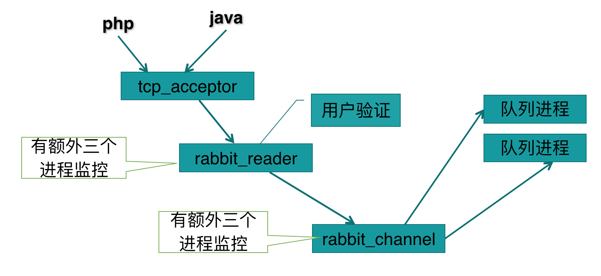

# 连接和通道

rabbitmq-server在启动的时候 

会进行监听 rabbitmq.config 或者 rabbitmq-env.conf 配置的5672端口

需要进行amqp 协议进行连接

## RabbitMQ 连接和通道主要相关进程

#### tcp_acceptor 

此进程是由rabbitmq-server在启动的时候,启动用于处理tcp握手的进程

#### rabbit_reader

此程是每个连接tcp握手成功后就会创建的一个进程,每个连接对应一个rabbit_reader,并且这个进程会额外的产生另外的三个监控进程.

rabbit_reader进程主要工作是读取当前tcp连接tcp发送过来的数据进行解析.

除了用户验证等基础业务逻辑外 ,基本不处理其他 业务逻辑

#### rabbit_channel

此程是每个连接里创建通道的时候,由rabbit_reader 创建的一个进程

每个通道对应一个 rabbit_channel 进程. 

在rabbit_reader 里从tcp连接读取出来的数据事先判断是哪一个通道的数据,则进行下发. channel进程拿到数据进行业务逻辑处理

每个channel进程,同样的会产生三个额外监控进程

**channel 进程主要工作**

- 事务逻辑处理
- confirm 确认 
- ack
- unack
- nack
- 通过exchange和routingkey找到队列,将消息下发给找到的队列进程

**队列进程 解析**

在每个节点上运行的队列, 都会生成一个进程

每个队列进程处理各自队列写入,持久化, 及消费者注册及数据消费和ACK等逻辑

由于Erlang底层是协程,所以队列数是可以非常之多.

由于rabbitmq amqp协议写入消费的时候,提交的参数是 exchange和Routingkey 两个参数,如果没有指定交换机的话默认为amq.default交换机.

**在写入的时候,并不是指定写入哪一个队列。而是通过exchange和routingkey找到队列**

channel 通道进程在拿到新写入的消息的时候, 拿到 exchange 和 Routingkey 到 mnesia 数据库查到与当前exchange和Routingkey同时绑定的队列列表,查到有哪些队列进程. 

然后将每个队列的进程PID,进行 分组: 主队列PID组及从队列PID组.

然后再异步的优先提交给主队列,再提交从队列进程. 

每个队列可能在集群节点里,多个节点上存在.但同一时刻只会有一个节点是某一个队列的主节点,其他为从节点,

**主从节点的概念是按队列来算的**,并不是按rabbitmq-server来算,不同于mysql的主从概念

**channel通道进程在提交数据给队列进程的时候 ,是给同一个队列的主从节点多写实现的**,并不是先写主,再由主同步给从的概念.

并且channel进程在往队列进程发送数据的时候,会进行判断 队列进程是不是属于当前erlang节点,如果不是的话,会自动走rabbitmq 启动的代理进程.. 代理进程之间通信协议由默认的25672 端口实现,当然这个端口是可以在我们的rabbitmq.config 配置文件中进行修改