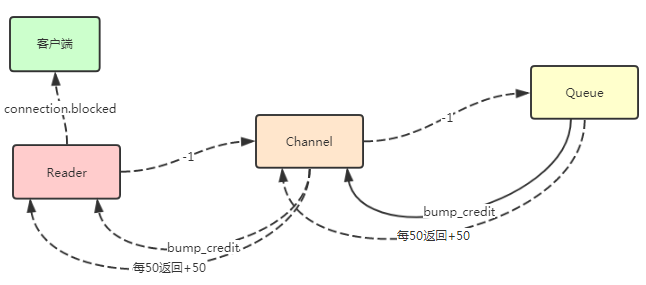

# 限流机制

在最开始的时候，我们讲到过每个连接有一个reader进程，每个通道是有一个chanel进程，每个队列也是一个Queue进程。在我们客户端 send数据到RabbitMQ的时候，是由Reader进程做协议解析，然后再将数据提交到对应的Channel进程，再Channel进程里通过提交的exchange和Routingkey找到绑定了哪些队列，并且再次将数据提交到相对应的 Queue进程里去。
上面所有提交都是异步提交的，所以上游可能提交了1万条消息，但是下游完全处理不过来。可能只能处理100条，这样推送是没多大意义的其实。

RabbitMQ开发者在这个过程中做了一下控制，当触发了流控机制的时候，就改变客户端和服务端连接的状态，并且通知客户端已经限流了，停目发送。 

#### 限流逻辑

##### 1. 上游和下游发送消息的时候，各自统计自己和指定进程ID通信的消息数量

 这里是数量，不是总消息大小。 这个值在3.5.x 某一个版本开始可以进行配置默认值为
 =={credit_flow_default_credit,{200,50}==},默认值为 {200,50}.
 
>     200 是上游可往下游发送的数量
>     50 是下游处理完了50条数据后，通知一下上游，可以继续再发50条。
    
这里为什么不是每接收一条就发送呢，这是RabbitMQ开发者为了考滤性能的优化

##### 2. 上游发送消息统计

上游往下游第一次发送消息的时候，200-1 = 199
第二次发送的时候，199-1 = 198 ，以此类推,直到 = 0 的时候，记录一下当前 当前进程 为block状态。

这个状态并不会真正影响这2个进程之间通信，只是一个key val值而已。

##### 3. 下游接收消息统计

下游在每一次接收上游消息的时候 ，50-1=49，第二次接收49-1=48，以此类推，直到 = 0 的时候，往上游发送一条指令{bump_credit, {self(), 50}}。

通知上游可以继续发送往这个进程发送50条消息，同时当前统计恢复成50. 

==假如这个时候上游接收到了这个指令并且上游进程同时也是其他进程的下游进程的时候，并且block状态，则会把继续往上一层上报 bump_credit 指令。==

##### 4. 一个进程同时是上游也是下游角色

假如一个进程同时是上游和下游角色。
比如Channel进程，假如做为下游角色准备返回 bump_credit

指令给上游Reader进程的时候，发送当前进程为block状态，则不会立马返回，而是保存到一个List里，等待下游Queue进程返回数据回来的时候，再一度返回给上游Reader进程。

##### 5. 上游接收到下游戏的bump_credit 指令

 在上游接收到下游发送回来的 bump_credit 指令的时候，上游进程把第三步那里那个状态给去掉，并且 可往下游发送的消息数量  + 50。

==假如Reader进程在接收到 bump_credit 指令的时候，+50 之后 还是 <=0或者并且Reader进程当和其他进程还存在block状态，则Reader进程把当前连接修改为blocking，并且往客户端发送一条指令 connection.blocked。==
 
 这个时候客户端就会没消息过来，阻塞在IO层了

==如果Reader进程在下游继续发送 bump_credit  过来的时候，总会有一次 满足 +50 > 0 并且和其他进程没有block状态，则通知客户端解除限流==

#### 小结

假如触发了限流机制，说明生产速度太快了，应该考滤多个连接或者多个队列存储了。或者修改配置{credit_flow_default_credit,{200,50}} 的值。